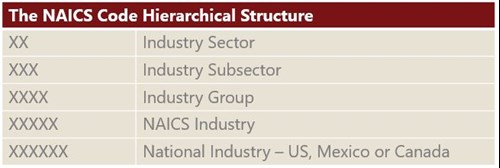
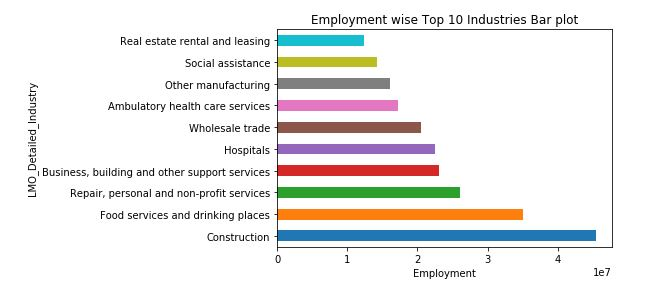
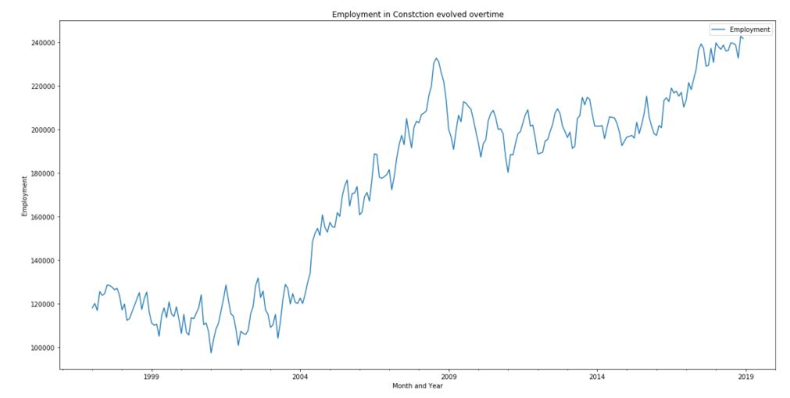

# Time Series Employment Analysis of NAICS

# Project Overview
The North American Industry Classification System
(NAICS) is an industry classification system developed by the statistical agencies of Canada,
Mexico and the United States. NAICS is designed to provide common definitions of the
industrial structure of the three countries and a common statistical framework to facilitate the
analysis of the three economies.

Following chart gives the analysis of NAICS codes

# Exploratory Analysis

Using the data exploratory analysis we find out the top 10 Industry sectors contributing to the Total Employment.

## Time Series analysis of Employment in Construction Sector
Construction Sector is the top most employment contribution sector. Following line plot shows the employment of Construction Sector evolved overtime.

The employment in Construction is rapidly increased from 2004 till the global crisis mid 2008. As the global crisis started there is decline in employment but recently it could able to catch up and now it is the top most industry contributing towards total employment.

Following line plot shows the percentage of Employment contributed by Construction Sector to the total employment overtime.

Following bar plot shows the various subsector's contribution towards employment of Construction Sector.

This shows that Specialty trade Contractors subsector is the largest employment contributor for the Construction Sector.

## Time Series Employment in Food services and drinking places Sector
Food services and drinking places Sector is the second largest employment contributor. 

Following bar plot shows the various subsector's contribution of employment for Food services and drinking places Sector.

## Time series Employment Analysis of Repair, personal and non-profit services Sector
Repair, personal and non-profit services Sector is the third largest employment contributor. Following line graph shows the percentage of employment contributed by this sector.

# Conclusion
More than 11% of employment is contributed by Construction Industry towards total employment every month from 2008 till now. 
The contribution of Food services and drinking places Sector towards total employment is very fluctuating between 7.5 to 9%.
Overall, the top three largest employment contributor sectors are contributing almost 20 to 25% of Total employment.